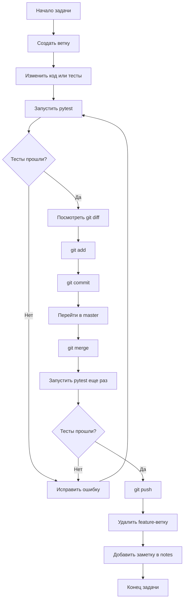

# Большой конспект: Python, pytest, Git и GitHub

Этот конспект - главная карта обучения. Его можно переписывать в тетрадь и продолжать дополнять после каждого нового урока.

## 1. Общая цель обучения

Цель курса - подготовить портфолио для позиции Junior QA / Junior QA Automation.

Основные направления:

- Python для написания тестов и вспомогательных функций.
- pytest для автотестов.
- Git для истории изменений.
- GitHub для хранения портфолио.
- Структура проекта, понятная работодателю.
- Постепенный переход к Playwright, Selenium и API-тестам.

## 2. Структура проекта

```text
python-practice-qa/
  README.md
  pytest.ini
  requirements.txt
  src/
    calculator.py
  tests/
    conftest.py
    test_calculator.py
  notes/
    day_01.md
    ...
    master_summary.md
```

Что где лежит:

- `src/` - код, который мы тестируем.
- `tests/` - автотесты.
- `tests/conftest.py` - общие фикстуры pytest.
- `notes/` - учебные конспекты.
- `README.md` - описание проекта для GitHub.
- `pytest.ini` - настройки pytest.
- `requirements.txt` - зависимости проекта.

## 3. Python: функции

Функция - это отдельное действие, которому можно дать имя.

Пример:

```python
def add(a: int | float, b: int | float) -> int | float:
    return a + b
```

Что важно:

- `def` создает функцию.
- `a` и `b` - параметры.
- `return` возвращает результат.
- `int | float` - подсказка типов: можно передать целое число или дробное.

Пройденные функции:

- `add` - сложение.
- `subtract` - вычитание.
- `multiply` - умножение.
- `divide` - деление.
- `power` - возведение в степень.
- `is_even` - проверка четности.
- `max_number` - большее из двух чисел.
- `min_number` - меньшее из двух чисел.
- `square` - квадрат числа.
- `average` - среднее двух чисел.
- `factorial` - факториал.
- `list_sum` - сумма списка.
- `list_average` - среднее значение списка.

## 4. Python: условия и ошибки

Условие используется, когда программа должна выбрать поведение.

Пример:

```python
def divide(a: int | float, b: int | float) -> float:
    if b == 0:
        raise ValueError("Cannot divide by zero")

    return a / b
```

Что важно:

- `if` проверяет условие.
- `raise` выбрасывает ошибку.
- `ValueError` означает ошибку неправильного значения.
- Ошибка не всегда плохо. Иногда это правильное поведение программы.

Пример негативного сценария:

```python
def factorial(number: int) -> int:
    if number < 0:
        raise ValueError("Factorial is not defined for negative numbers")
```

## 5. pytest: базовая идея

pytest - фреймворк для запуска тестов.

Простой тест:

```python
def test_add_positive_numbers():
    assert add(2, 3) == 5
```

Что важно:

- Файл с тестами обычно называется `test_*.py`.
- Тестовая функция начинается с `test_`.
- `assert` проверяет ожидаемый результат.
- Если assert ложный, тест падает.

Запуск всех тестов:

```powershell
python -m pytest
```

## 6. pytest: импорт функций

Чтобы протестировать функцию из другого файла, ее нужно импортировать.

Пример:

```python
from src.calculator import add, divide, factorial
```

Типичная ошибка:

```text
NameError: name 'power' is not defined
```

Причина: функция есть в `calculator.py`, но не импортирована в тестовый файл.

## 7. pytest: параметризация

Параметризация позволяет запускать один тест с разными данными.

Пример:

```python
@pytest.mark.parametrize(
    "number, expected",
    [
        (4, True),
        (5, False),
        (0, True),
        (-2, True),
        (-3, False),
    ],
)
def test_is_even(number, expected):
    assert is_even(number) is expected
```

Что происходит:

- `pytest` берет первый набор данных.
- Подставляет значения в аргументы теста.
- Запускает тест.
- Потом повторяет для остальных наборов.

Зачем нужно:

- меньше копипасты;
- легче добавить новые проверки;
- тест выглядит как таблица сценариев.

## 8. pytest: негативные тесты и pytest.raises

Негативный тест проверяет неправильные или запрещенные данные.

Пример:

```python
def test_divide_by_zero_raises_error():
    with pytest.raises(ValueError, match="Cannot divide by zero"):
        divide(10, 0)
```

Что важно:

- `pytest.raises` ожидает ошибку.
- Тест проходит, если нужная ошибка действительно произошла.
- `match` проверяет текст ошибки.

Примеры негативных сценариев:

- деление на ноль;
- факториал отрицательного числа;
- среднее значение пустого списка.

## 9. pytest: фикстуры

Фикстура готовит данные или состояние для теста.

Пример:

```python
@pytest.fixture
def sample_numbers():
    return [1, 2, 3, 4, 5]
```

Использование:

```python
def test_list_sum(sample_numbers):
    assert list_sum(sample_numbers) == 15
```

Что важно:

- Фикстуру не нужно вызывать вручную.
- Мы не пишем `sample_numbers()`.
- `pytest` видит аргумент `sample_numbers`.
- Потом pytest находит фикстуру с таким же именем и передает в тест результат.

## 10. pytest: conftest.py

`conftest.py` - специальный файл pytest для общих фикстур.

Пример структуры:

```text
tests/
  conftest.py
  test_calculator.py
```

Пример:

```python
import pytest


@pytest.fixture(scope="function")
def sample_numbers():
    return [1, 2, 3, 4, 5]
```

Что важно:

- `conftest.py` не нужно импортировать.
- pytest сам находит этот файл.
- Фикстуры из `conftest.py` доступны тестам в этой папке и вложенных папках.
- Это удобно, когда тестовых файлов становится много.

## 11. pytest: fixture scope

Scope управляет тем, как часто создается фикстура.

Основные варианты:

```python
@pytest.fixture(scope="function")
```

Создается отдельно для каждого теста.

```python
@pytest.fixture(scope="module")
```

Создается один раз на тестовый файл.

```python
@pytest.fixture(scope="session")
```

Создается один раз на весь запуск pytest.

Главная идея:

- `function` - чаще, но изолированнее.
- `module` - реже, удобно для общих данных файла.
- `session` - очень редко, удобно для дорогой подготовки.

Для Playwright это будет важно:

- браузер можно открыть один раз на сессию;
- страницу лучше готовить отдельно для теста;
- тестовые данные можно создавать фикстурами.

## 12. pytest: markers

Маркер - это метка теста.

Пример:

```python
@pytest.mark.smoke
def test_add_positive_numbers():
    assert add(2, 3) == 5
```

Зачем нужны маркеры:

- запускать только smoke-тесты;
- запускать только negative-тесты;
- отделять regression-набор;
- управлять тестами в CI.

Файл `pytest.ini`:

```ini
[pytest]
markers =
    smoke: critical fast tests
    regression: full regression test set
    negative: tests for invalid input and errors
```

Запуск:

```powershell
python -m pytest -m smoke
python -m pytest -m negative
python -m pytest -m "not negative"
```

Что значит `deselected`:

- pytest нашел тесты;
- но не выбрал их для запуска из-за фильтра `-m`.

## 13. pytest: режимы запуска

Обычный запуск:

```powershell
python -m pytest
```

Подробный вывод:

```powershell
python -m pytest -v
```

Показывает имена тестов и их статус.

Короткий вывод:

```powershell
python -m pytest -q
```

Показывает меньше служебной информации.

Расширенная сводка:

```powershell
python -m pytest -ra
```

Полезно, когда есть пропущенные, упавшие или ожидаемо падающие тесты.

Комбинация:

```powershell
python -m pytest -v -m smoke
```

Запускает только smoke-тесты и показывает их подробно.

## 14. Git: главная идея

Git хранит историю проекта.

Основные зоны:

```text
Working tree -> Staging area -> Commit history
```

Что это значит:

- Working tree - файлы, которые мы редактируем.
- Staging area - изменения, подготовленные к коммиту.
- Commit history - сохраненная история проекта.

Базовый цикл:

```powershell
git status
git diff
python -m pytest
git add .
git commit -m "Message"
git log --oneline
```

## 15. Git: основные команды

Проверить состояние:

```powershell
git status
git status --short
```

Посмотреть изменения:

```powershell
git diff
```

Подготовить изменения:

```powershell
git add README.md
git add .
```

Создать коммит:

```powershell
git commit -m "Add feature"
```

Посмотреть историю:

```powershell
git log --oneline
```

## 16. Git: ветки

Ветка - отдельная линия работы над задачей.

Создать ветку и перейти в нее:

```powershell
git switch -c feature/add-new-tests
```

Посмотреть ветки:

```powershell
git branch
```

Перейти в master:

```powershell
git switch master
```

Влить ветку:

```powershell
git merge feature/add-new-tests
```

Удалить ветку после merge:

```powershell
git branch -d feature/add-new-tests
```

Правило:

```text
Одна ветка - одна небольшая задача.
```

## 17. GitHub

Git хранит историю локально.

GitHub хранит копию репозитория в интернете.

Подключить GitHub:

```powershell
git remote add origin https://github.com/username/repository.git
```

Первый push:

```powershell
git push -u origin master
```

Следующие push:

```powershell
git push
```

Проверка:

```powershell
git log --oneline
git status --short --branch
```

Если видно:

```text
HEAD -> master, origin/master
```

значит локальный проект и GitHub находятся на одном коммите.

## 18. Рабочий процесс QA Automation

Обычный цикл работы:

```text
1. Создать ветку под задачу.
2. Изменить код или тесты.
3. Запустить тесты.
4. Посмотреть git diff.
5. Сделать git add.
6. Сделать git commit.
7. Перейти в master.
8. Сделать merge.
9. Запустить тесты еще раз.
10. Сделать git push.
11. Удалить feature-ветку.
12. Добавить заметку по уроку.
```

Команды:

```powershell
git switch -c feature/task-name
python -m pytest
git diff
git add .
git commit -m "Message"
git switch master
git merge feature/task-name
python -m pytest
git push
git branch -d feature/task-name
```

## 19. Блок-схема рабочего процесса



## 20. Упрощенная блок-схема для тетради

```text
[Задача]
   |
   v
[Новая ветка]
   |
   v
[Код + тесты]
   |
   v
[pytest]
   |
   +--> если ошибка -> [исправить] -> [pytest]
   |
   v
[git diff]
   |
   v
[git add]
   |
   v
[git commit]
   |
   v
[merge в master]
   |
   v
[pytest]
   |
   v
[git push]
   |
   v
[заметка]
```

## 21. Как продолжать конспект

После каждого урока добавлять блок:

````markdown
## День N: тема

### Что изучил

- ...

### Что сделал руками

- ...

### Главная команда или код

```powershell
...
```

### Что было непонятно

- ...

### Как объяснить своими словами

...
````

## 22. Словарь

- `function` - функция.
- `return` - вернуть результат.
- `assert` - проверка ожидаемого результата.
- `import` - импорт функции или объекта.
- `test` - проверка поведения.
- `fixture` - подготовленные данные или состояние для теста.
- `scope` - область жизни фикстуры.
- `marker` - метка теста.
- `smoke` - быстрые критичные тесты.
- `regression` - проверка, что старое поведение не сломалось.
- `negative test` - тест с неправильными данными.
- `exception` - исключение, ошибка выполнения.
- `raise` - выбросить ошибку.
- `commit` - сохраненная точка истории.
- `branch` - ветка.
- `merge` - слияние веток.
- `remote` - удаленный репозиторий.
- `push` - отправка коммитов на GitHub.
- `deselected` - тест найден, но не выбран для запуска.

## 23. Что уже есть в портфолио

В проекте уже есть:

- Python-функции.
- Тесты на pytest.
- Параметризация.
- Негативные тесты.
- `pytest.raises`.
- Фикстуры.
- `conftest.py`.
- Fixture scope.
- Pytest markers.
- `pytest.ini`.
- README с командами запуска.
- Git-история.
- GitHub-репозиторий.
- Учебные заметки.

## 24. Следующие темы

Дальше можно добавлять:

- HTML-отчеты pytest.
- `pytest-html`.
- API-тесты через `requests`.
- JSON и проверки API-ответов.
- Playwright.
- Selenium.
- Page Object Model.
- GitHub Actions.
- Резюме и описание проектов.
