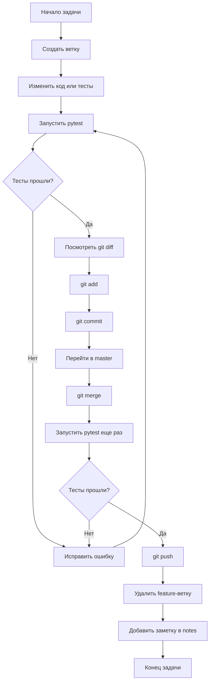

# Большой конспект: Junior QA Automation

Этот конспект - главная карта обучения Python, pytest, API, Playwright, Git и CI/CD. Он собран по материалам уроков 1-82 и предназначен для повторения и переписывания в тетрадь.

## 1. Общая цель обучения

Цель курса - подготовить портфолио для позиции Junior QA / Junior QA Automation.

Основные направления:

- Python для написания тестов и вспомогательных функций.
- pytest для автотестов.
- Git для истории изменений.
- GitHub для хранения портфолио.
- Структура проекта, понятная работодателю.
- Постепенный переход к Playwright, Selenium и API-тестам.

## 2. Структура проекта

```text
python-practice-qa/
  .github/
    workflows/
      tests.yml
    dependabot.yml
  README.md
  pytest.ini
  requirements.txt
  src/
    api_client.py
    calculator.py
    config.py
  tests/
    api/
      conftest.py
      test_api_client.py
      test_create_post.py
      test_delete_post.py
      test_get_posts.py
      test_update_post.py
    ui/
      pages/
        todo_page.py
      conftest.py
      test_example_page.py
      test_network.py
      test_network_mock.py
      test_todo_page.py
    conftest.py
    test_calculator.py
    test_config.py
  notes/
    day_01.md
    ...
    day_82.md
    master_summary.md
```

Что где лежит:

- `src/` - код, который мы тестируем: функции и API-клиент.
- `tests/api/` - API-тесты и локальные API-фикстуры.
- `tests/ui/` - UI-тесты Playwright и Page Object.
- `tests/conftest.py` - общие фикстуры pytest.
- `notes/` - учебные конспекты.
- `README.md` - описание проекта для GitHub.
- `pytest.ini` - настройки pytest.
- `requirements.txt` - зависимости проекта.
- `.github/workflows/tests.yml` - CI pipeline GitHub Actions.
- `.github/dependabot.yml` - автоматический поиск обновлений GitHub Actions.

## 3. API: главная идея

API - это способ общения программ друг с другом через запросы и ответы.

В наших тестах мы работаем с HTTP-запросами:

- `GET` - получить данные.
- `POST` - создать данные.
- `PUT` - полностью обновить ресурс.
- `PATCH` - частично обновить ресурс.
- `DELETE` - удалить ресурс.

Пример:

```python
response = api_client.get_post(1)
data = response.json()

assert response.status_code == 200
assert data["id"] == 1
```

Что важно:

- `response.status_code` - HTTP-статус ответа.
- `response.json()` - превращает JSON-ответ в Python-словарь или список.
- API-тест должен проверять не только статус, но и данные в ответе.
- Для списков важно проверять структуру объектов и типы полей.

## 4. API client

Чтобы не писать `requests.get(...)` в каждом тесте, мы вынесли общий код в `src/api_client.py`.

Пример:

```python
class ApiClient:
    def __init__(self, base_url: str, timeout: int = 10):
        self.base_url = base_url
        self.timeout = timeout

    def get(self, path: str):
        return requests.get(f"{self.base_url}{path}", timeout=self.timeout)
```

Методы клиента:

- `get_post(post_id)` - получить один пост.
- `get_posts()` - получить список постов.
- `create_post(payload)` - создать пост.
- `update_post(post_id, payload)` - полностью обновить пост.
- `patch_post(post_id, payload)` - частично обновить пост.
- `delete_post(post_id)` - удалить пост.

Зачем это нужно:

- меньше повторения в тестах;
- легче добавлять общую логику в одном месте;
- удобнее развивать проект дальше.

## 5. API tests: что мы уже умеем

Мы уже проверяем:

- успешные ответы `200` и `201`;
- негативный сценарий `404`;
- поля ответа `userId`, `id`, `title`, `body`;
- типы данных в ответе;
- список объектов;
- время ответа API;
- отправленные данные после `POST`;
- обновленные данные после `PUT` и `PATCH`;
- пустое тело ответа после `DELETE`.

Пример теста с параметризацией:

```python
@pytest.mark.parametrize("post_id", [1, 2, 3, 4, 5])
def test_get_post_by_id_parametrized(api_client, post_id):
    response = api_client.get_post(post_id)
    data = response.json()

    assert response.status_code == 200
    assert data["id"] == post_id
```

Пример payload-фикстуры:

```python
@pytest.fixture
def new_post_payload():
    return {
        "title": "Test title",
        "body": "Test body",
        "userId": 1,
    }
```

## 6. API tests: важные рабочие идеи

- `timeout` ограничивает ожидание ответа и защищает тесты от зависания.
- `response.elapsed` показывает время ответа.
- Слишком жесткая проверка времени может сделать тест `flaky`.
- Один файл можно пометить общим маркером:

```python
pytestmark = pytest.mark.api
```

- Один тест может иметь несколько маркеров, например `api` и `negative`.
- Можно запускать разные наборы:

```powershell
python -m pytest -m api
python -m pytest -m "api and negative"
python -m pytest -m "api and not negative"
```

## 7. Python: функции

Функция - это отдельное действие, которому можно дать имя.

Пример:

```python
def add(a: int | float, b: int | float) -> int | float:
    return a + b
```

Что важно:

- `def` создает функцию.
- `a` и `b` - параметры.
- `return` возвращает результат.
- `int | float` - подсказка типов: можно передать целое число или дробное.

Пройденные функции:

- `add` - сложение.
- `subtract` - вычитание.
- `multiply` - умножение.
- `divide` - деление.
- `power` - возведение в степень.
- `is_even` - проверка четности.
- `max_number` - большее из двух чисел.
- `min_number` - меньшее из двух чисел.
- `square` - квадрат числа.
- `average` - среднее двух чисел.
- `factorial` - факториал.
- `list_sum` - сумма списка.
- `list_average` - среднее значение списка.

## 8. Python: условия и ошибки

Условие используется, когда программа должна выбрать поведение.

Пример:

```python
def divide(a: int | float, b: int | float) -> float:
    if b == 0:
        raise ValueError("Cannot divide by zero")

    return a / b
```

Что важно:

- `if` проверяет условие.
- `raise` выбрасывает ошибку.
- `ValueError` означает ошибку неправильного значения.
- Ошибка не всегда плохо. Иногда это правильное поведение программы.

Пример негативного сценария:

```python
def factorial(number: int) -> int:
    if number < 0:
        raise ValueError("Factorial is not defined for negative numbers")
```

## 9. pytest: базовая идея

pytest - фреймворк для запуска тестов.

Простой тест:

```python
def test_add_positive_numbers():
    assert add(2, 3) == 5
```

Что важно:

- Файл с тестами обычно называется `test_*.py`.
- Тестовая функция начинается с `test_`.
- `assert` проверяет ожидаемый результат.
- Если assert ложный, тест падает.

Запуск всех тестов:

```powershell
python -m pytest
```

## 10. pytest: импорт функций

Чтобы протестировать функцию из другого файла, ее нужно импортировать.

Пример:

```python
from src.calculator import add, divide, factorial
```

Типичная ошибка:

```text
NameError: name 'power' is not defined
```

Причина: функция есть в `calculator.py`, но не импортирована в тестовый файл.

## 11. pytest: параметризация

Параметризация позволяет запускать один тест с разными данными.

Пример:

```python
@pytest.mark.parametrize(
    "number, expected",
    [
        (4, True),
        (5, False),
        (0, True),
        (-2, True),
        (-3, False),
    ],
)
def test_is_even(number, expected):
    assert is_even(number) is expected
```

Что происходит:

- `pytest` берет первый набор данных.
- Подставляет значения в аргументы теста.
- Запускает тест.
- Потом повторяет для остальных наборов.

Зачем нужно:

- меньше копипасты;
- легче добавить новые проверки;
- тест выглядит как таблица сценариев.

## 12. pytest: негативные тесты и pytest.raises

Негативный тест проверяет неправильные или запрещенные данные.

Пример:

```python
def test_divide_by_zero_raises_error():
    with pytest.raises(ValueError, match="Cannot divide by zero"):
        divide(10, 0)
```

Что важно:

- `pytest.raises` ожидает ошибку.
- Тест проходит, если нужная ошибка действительно произошла.
- `match` проверяет текст ошибки.

Примеры негативных сценариев:

- деление на ноль;
- факториал отрицательного числа;
- среднее значение пустого списка.

## 13. pytest: фикстуры

Фикстура готовит данные или состояние для теста.

Пример:

```python
@pytest.fixture
def sample_numbers():
    return [1, 2, 3, 4, 5]
```

Использование:

```python
def test_list_sum(sample_numbers):
    assert list_sum(sample_numbers) == 15
```

Что важно:

- Фикстуру не нужно вызывать вручную.
- Мы не пишем `sample_numbers()`.
- `pytest` видит аргумент `sample_numbers`.
- Потом pytest находит фикстуру с таким же именем и передает в тест результат.

## 14. pytest: conftest.py

`conftest.py` - специальный файл pytest для общих фикстур.

Пример структуры:

```text
tests/
  conftest.py
  test_calculator.py
```

Пример:

```python
import pytest


@pytest.fixture(scope="function")
def sample_numbers():
    return [1, 2, 3, 4, 5]
```

Что важно:

- `conftest.py` не нужно импортировать.
- pytest сам находит этот файл.
- Фикстуры из `conftest.py` доступны тестам в этой папке и вложенных папках.
- Это удобно, когда тестовых файлов становится много.

## 15. pytest: fixture scope

Scope управляет тем, как часто создается фикстура.

Основные варианты:

```python
@pytest.fixture(scope="function")
```

Создается отдельно для каждого теста.

```python
@pytest.fixture(scope="module")
```

Создается один раз на тестовый файл.

```python
@pytest.fixture(scope="session")
```

Создается один раз на весь запуск pytest.

Главная идея:

- `function` - чаще, но изолированнее.
- `module` - реже, удобно для общих данных файла.
- `session` - очень редко, удобно для дорогой подготовки.

Для Playwright это будет важно:

- браузер можно открыть один раз на сессию;
- страницу лучше готовить отдельно для теста;
- тестовые данные можно создавать фикстурами.

## 16. pytest: markers

Маркер - это метка теста.

Пример:

```python
@pytest.mark.smoke
def test_add_positive_numbers():
    assert add(2, 3) == 5
```

Зачем нужны маркеры:

- запускать только smoke-тесты;
- запускать только negative-тесты;
- отделять regression-набор;
- управлять тестами в CI.

Файл `pytest.ini`:

```ini
[pytest]
markers =
    smoke: critical fast tests
    regression: full regression test set
    negative: tests for invalid input and errors
    api: API tests
```

Запуск:

```powershell
python -m pytest -m smoke
python -m pytest -m negative
python -m pytest -m "not negative"
python -m pytest -m api
python -m pytest -m "api and negative"
```

Что значит `deselected`:

- pytest нашел тесты;
- но не выбрал их для запуска из-за фильтра `-m`.

## 17. pytest: режимы запуска

Обычный запуск:

```powershell
python -m pytest
```

Подробный вывод:

```powershell
python -m pytest -v
```

Показывает имена тестов и их статус.

Короткий вывод:

```powershell
python -m pytest -q
```

Показывает меньше служебной информации.

Расширенная сводка:

```powershell
python -m pytest -ra
```

Полезно, когда есть пропущенные, упавшие или ожидаемо падающие тесты.

Комбинация:

```powershell
python -m pytest -v -m smoke
```

Запускает только smoke-тесты и показывает их подробно.

## 18. Git: главная идея

Git хранит историю проекта.

Основные зоны:

```text
Working tree -> Staging area -> Commit history
```

Что это значит:

- Working tree - файлы, которые мы редактируем.
- Staging area - изменения, подготовленные к коммиту.
- Commit history - сохраненная история проекта.

Базовый цикл:

```powershell
git status
git diff
python -m pytest
git add .
git commit -m "Message"
git log --oneline
```

## 19. Git: основные команды

Проверить состояние:

```powershell
git status
git status --short
```

Посмотреть изменения:

```powershell
git diff
```

Подготовить изменения:

```powershell
git add README.md
git add .
```

Создать коммит:

```powershell
git commit -m "Add feature"
```

Посмотреть историю:

```powershell
git log --oneline
```

## 20. Git: ветки

Ветка - отдельная линия работы над задачей.

Создать ветку и перейти в нее:

```powershell
git switch -c feature/add-new-tests
```

Посмотреть ветки:

```powershell
git branch
```

Перейти в master:

```powershell
git switch master
```

Влить ветку:

```powershell
git merge feature/add-new-tests
```

Удалить ветку после merge:

```powershell
git branch -d feature/add-new-tests
```

Правило:

```text
Одна ветка - одна небольшая задача.
```

## 21. GitHub

Git хранит историю локально.

GitHub хранит копию репозитория в интернете.

Подключить GitHub:

```powershell
git remote add origin https://github.com/username/repository.git
```

Первый push:

```powershell
git push -u origin master
```

Следующие push:

```powershell
git push
```

Проверка:

```powershell
git log --oneline
git status --short --branch
```

Если видно:

```text
HEAD -> master, origin/master
```

значит локальный проект и GitHub находятся на одном коммите.

## 22. Рабочий процесс QA Automation

Обычный цикл работы:

```text
1. Создать ветку под задачу.
2. Изменить код или тесты.
3. Запустить тесты.
4. Посмотреть git diff.
5. Сделать git add.
6. Сделать git commit.
7. Перейти в master.
8. Сделать merge.
9. Запустить тесты еще раз.
10. Сделать git push.
11. Удалить feature-ветку.
12. Добавить заметку по уроку.
```

Команды:

```powershell
git switch -c feature/task-name
python -m pytest
git diff
git add .
git commit -m "Message"
git switch master
git merge feature/task-name
python -m pytest
git push
git branch -d feature/task-name
```

## 23. Блок-схема рабочего процесса


```mermaid
flowchart TD
    A["Начало задачи"] --> B["Создать ветку"]
    B --> C["Изменить код или тесты"]
    C --> D["Запустить pytest"]
    D --> E{"Тесты прошли?"}
    E -- "Нет" --> F["Исправить ошибку"]
    F --> D
    E -- "Да" --> G["Посмотреть git diff"]
    G --> H["git add"]
    H --> I["git commit"]
    I --> J["Перейти в master"]
    J --> K["git merge"]
    K --> L["Запустить pytest еще раз"]
    L --> M{"Тесты прошли?"}
    M -- "Нет" --> F
    M -- "Да" --> N["git push"]
    N --> O["Удалить feature-ветку"]
    O --> P["Добавить заметку в notes"]
    P --> Q["Конец задачи"]
```

## 24. Упрощенная блок-схема для тетради

```text
[Задача]
   |
   v
[Новая ветка]
   |
   v
[Код + тесты]
   |
   v
[pytest]
   |
   +--> если ошибка -> [исправить] -> [pytest]
   |
   v
[git diff]
   |
   v
[git add]
   |
   v
[git commit]
   |
   v
[merge в master]
   |
   v
[pytest]
   |
   v
[git push]
   |
   v
[заметка]
```

## 25. Как продолжать конспект

После каждого урока добавлять блок:

````markdown
## День N: тема

### Что изучил

- ...

### Что сделал руками

- ...

### Главная команда или код

```powershell
...
```

### Где это нужно в реальной работе

- ...

### Что было непонятно

- ...

### Как объяснить своими словами

...
````

## 26. Словарь

- `function` - функция.
- `return` - вернуть результат.
- `assert` - проверка ожидаемого результата.
- `import` - импорт функции или объекта.
- `test` - проверка поведения.
- `fixture` - подготовленные данные или состояние для теста.
- `scope` - область жизни фикстуры.
- `marker` - метка теста.
- `smoke` - быстрые критичные тесты.
- `regression` - проверка, что старое поведение не сломалось.
- `negative test` - тест с неправильными данными.
- `exception` - исключение, ошибка выполнения.
- `raise` - выбросить ошибку.
- `commit` - сохраненная точка истории.
- `branch` - ветка.
- `merge` - слияние веток.
- `remote` - удаленный репозиторий.
- `push` - отправка коммитов на GitHub.
- `deselected` - тест найден, но не выбран для запуска.
- `API` - способ общения программ друг с другом.
- `HTTP` - протокол запросов и ответов.
- `GET` - получить данные.
- `POST` - создать данные.
- `PUT` - полностью обновить ресурс.
- `PATCH` - частично обновить ресурс.
- `DELETE` - удалить ресурс.
- `payload` - данные, которые отправляются в запросе.
- `JSON` - формат данных.
- `status code` - код ответа сервера.
- `response body` - тело ответа.
- `API client` - объект для отправки API-запросов.
- `timeout` - ограничение времени ожидания ответа.
- `flaky test` - нестабильный тест.
- `response time` - время ответа.
- `test data` - тестовые данные.
- `nodeid` - полный адрес конкретного теста в pytest.
- `targeted run` - выборочный запуск одного теста или файла.
- `assert message` - объяснение причины падения проверки.
- `pytest.param` - отдельный именованный набор параметров.
- `ids` - понятные названия параметризованных сценариев.
- `pytest.approx` - сравнение дробных чисел с погрешностью.
- `test collection` - этап поиска тестов pytest.
- `query parameter` - параметр фильтрации в URL после `?`.
- `filtering` - отбор данных по условию.
- `pagination` - получение больших списков по страницам.
- `success rate` - процент успешных операций.
- `failure rate` - процент неуспешных операций.

## 27. Что уже есть в портфолио

В проекте уже есть:

- Python-функции.
- Тесты на pytest.
- Параметризация.
- Негативные тесты.
- `pytest.raises`.
- Фикстуры.
- `conftest.py`.
- Fixture scope.
- Pytest markers.
- HTML-отчеты pytest.
- `pytest.ini`.
- API-тесты через `requests`.
- `ApiClient` в `src/api_client.py`.
- GET, POST, PUT, PATCH, DELETE.
- Позитивные и негативные API-сценарии.
- Проверка JSON-ответов.
- Проверка структуры и типов данных.
- API-маркер и комбинированные фильтры.
- Timeout и разбор flaky-теста.
- Payload-фикстуры для тестовых данных.
- README с командами запуска.
- Git-история.
- GitHub-репозиторий.
- Учебные заметки.
- API-тесты разделены по операциям и лежат в `tests/api`.
- API-фикстуры вынесены в локальный `tests/api/conftest.py`.
- Выборочный запуск по файлу, nodeid и выражению `-k`.
- Понятные сообщения об ошибках в API-проверках.
- Параметризация с `ids` и `pytest.param`.
- Проверка float-значений через `pytest.approx`.
- Расчет тестовых метрик: success rate и failure rate.
- Сводка тестового прогона в виде словаря.
- API-фильтрация через query parameters.
- Проверка всех элементов ответа через `all(...)`.
- API-пагинация и несколько query parameters.
- `requests.Session`, общие headers и закрытие соединений.
- Bearer token и настройки из переменных окружения.
- Unit-тест HTTP-вызова через `monkeypatch` без реального интернета.
- UI-тесты Playwright для TodoMVC.
- Web-first assertions и устойчивые locators.
- Локальная UI-фикстура и Page Object Model.
- Параметризованные позитивные и негативные UI-сценарии.
- Playwright trace, screenshots и network inspection.
- Перехват и mock сетевых запросов через `page.route`.
- GitHub Actions для push, Pull Request, ручного и планового запуска.
- Отдельные smoke, regression и browser matrix jobs.
- HTML- и JUnit-отчёты, Playwright artifacts.
- Dependabot и практика review dependency Pull Requests.
- Всего `111` собранных pytest-сценариев: `57` calculator, `37` API, `4` config и `13` UI.

## 28. Следующие темы

Дальше добавляем:

- Selenium WebDriver и сравнение его ожиданий с Playwright;
- Selenium Page Object и кросс-браузерный запуск;
- SQL для проверки данных на уровне базы;
- Docker для одинакового локального и CI-окружения;
- более реалистичный API с авторизацией и созданием тестовых данных;
- собственный портфельный проект вместо одного демонстрационного сайта;
- тест-дизайн, баг-репорты и тестовую документацию;
- подготовку резюме, GitHub-профиля и ответов для собеседований.

## 29. Контрольная точка: уроки 32-54

### Что улучшилось в структуре проекта

- API-тесты разделены по темам: GET, POST, PUT/PATCH и DELETE.
- API-тесты перенесены в отдельную папку `tests/api`.
- Общие API-фикстуры хранятся рядом с API-тестами.
- `pytest.ini` автоматически задает папку `tests` и короткий вывод.
- README содержит основные команды запуска.

### Что закреплено в pytest

- Выборочный запуск файла и одного теста по nodeid.
- Фильтрация тестов через `-k` и markers.
- Параметризация позитивных и негативных сценариев.
- Понятные `ids` и `pytest.param`.
- Проверка исключений через `pytest.raises` и `match`.
- Сравнение дробных результатов через `pytest.approx`.
- Понятные assert-сообщения для CI/CD и HTML-отчетов.
- Правило именования: обычные функции не начинаются с `test_`.

### Что закреплено в API

- CRUD-запросы: GET, POST, PUT, PATCH, DELETE.
- Проверка status code, JSON, полей, типов и времени ответа.
- Позитивные и негативные API-сценарии.
- API-клиент с общим timeout.
- Query parameters через аргумент `params` библиотеки requests.
- Проверка фильтра: каждый элемент ответа должен подходить под условие.

### Реальные примеры применения

- Query parameters нужны для поиска, фильтрации, сортировки и пагинации.
- `pytest.approx` нужен для процентов, метрик и других float-значений.
- Success rate и failure rate используются в тестовых отчетах и CI/CD.
- Выборочный запуск ускоряет локальную разработку, а полный прогон защищает от регрессии.
- Понятный assert помогает быстрее расследовать падение в pipeline.

### Текущее состояние

```text
57 calculator tests
26 API tests
83 tests total
```

### Обновленный рабочий процесс

1. Ученик самостоятельно пишет код по заданию.
2. Запускает целевые тесты и полный набор.
3. Проверяет `git diff --check`.
4. Наставник проверяет diff и автоматически сохраняет конспект.
5. После кода разбирается один вопрос собеседования в приватном файле.
6. Ветка коммитится, объединяется с `master` и отправляется на GitHub.

## 30. Контрольная точка: уроки 55-61

### API-пагинация

Пагинация делит большой ответ на страницы. Номер страницы и размер передаются как query parameters:

```python
params = {
    "_page": page,
    "_limit": limit,
}
```

Тест пагинации проверяет не только `200`, но и:

- количество элементов;
- первый и последний объект;
- правильный порядок;
- пустой результат после последней страницы;
- граничные значения `page` и `limit`.

Реальный пример: каталог содержит миллион товаров. Клиент запрашивает по 20 товаров, а тест проверяет, что страницы не пропускают и не дублируют позиции.

### `requests.Session`

Session хранит общие настройки и переиспользует соединения:

```python
self.session = requests.Session()
self.session.headers.update(
    {"Accept": "application/json"}
)
```

В одном месте можно настроить общие headers, cookies и авторизацию. После API-авторизации session может хранить cookie, чтобы следующие запросы к профилю и заказам выполнялись от имени того же пользователя.

### Setup и teardown

Fixture с `yield` выполняет подготовку до теста и очистку после него:

```python
@pytest.fixture
def api_client():
    client = ApiClient(base_url)
    yield client
    client.close()
```

Очистка нужна для закрытия session, браузера, подключения к базе, временных файлов и созданных тестовых данных. Она должна выполняться даже после падения теста.

### Bearer token

Token передаётся в header:

```text
Authorization: Bearer <token>
```

Настоящие token, пароль и API key нельзя хранить в коде или Git. Они передаются через environment variables или CI secrets.

Разница статусов:

- `401 Unauthorized` - пользователь не прошёл аутентификацию;
- `403 Forbidden` - пользователь известен, но у него нет нужного разрешения.

Реальный пример: обычный пользователь получает `403` при попытке удалить чужой заказ, а администратор получает успешный ответ.

### Переменные окружения

```python
api_token = os.getenv("API_TOKEN")
base_url = os.getenv("API_BASE_URL", default_url)
```

Один код можно запускать на `dev`, `stage` и другом стенде без изменения исходных файлов. В тестах `monkeypatch.setenv()` создаёт контролируемое значение и не зависит от настроек компьютера.

### Unit-тест внешнего вызова

`monkeypatch` позволяет заменить реальный HTTP-метод тестовым double. Такой unit-тест:

- не зависит от интернета;
- работает быстро;
- проверяет точные аргументы вызова;
- воспроизводит нужный ответ или исключение.

Integration-тест с реальным API всё равно нужен, но решает другую задачу: проверяет настоящее взаимодействие компонентов.

## 31. Контрольная точка: уроки 62-73

### Playwright и первый UI-тест

Playwright управляет браузером и проверяет приложение с точки зрения пользователя. Типовой сценарий:

```python
page.goto(base_url)
page.get_by_placeholder("What needs to be done?").fill(title)
page.get_by_placeholder("What needs to be done?").press("Enter")
expect(page.get_by_text(title, exact=True)).to_be_visible()
```

UI-тест проверяет браузер, DOM, JavaScript и пользовательское взаимодействие. Он ближе к реальному сценарию, но обычно медленнее unit- и API-теста.

### Locators

Предпочтительный порядок локаторов:

1. Role и доступное имя.
2. Label или placeholder поля.
3. Стабильный `data-testid`.
4. Короткий устойчивый CSS locator.

Нужно избегать длинных CSS/XPath-цепочек, зависящих от случайной вложенности и оформления.

### Web-first assertions

```python
expect(locator).to_be_visible()
expect(locator).to_be_checked()
expect(locator).to_have_count(2)
```

Playwright повторяет такую проверку до выполнения условия или timeout. Это устойчивее немедленного `assert` и искусственного `sleep`.

Реальный пример: кнопка появляется после ответа API. Web-first assertion ждёт именно видимость кнопки, а `sleep(5)` всегда теряет пять секунд и всё равно может оказаться недостаточным.

### Изоляция тестов

Fixture `page` создаёт для каждого теста новый browser context. Cookies, local storage и состояние одного теста не должны влиять на другой.

Изоляция важна, потому что тесты могут выполняться в другом порядке, запускаться отдельно, работать параллельно или падать до очистки состояния.

### Base URL и локальный `conftest.py`

`base_url` хранится в `pytest.ini`, а UI-фикстуры находятся в `tests/ui/conftest.py`. Они доступны только UI-поддереву и не засоряют API- или calculator-тесты.

### Page Object Model

Page Object хранит локаторы и действия страницы:

```python
class TodoPage:
    def add_todo(self, title: str) -> None:
        self.todo_input.fill(title)
        self.todo_input.press("Enter")
```

Тест хранит сценарий и проверки:

```python
todo_page.add_todo(title)
expect(todo_page.todo_title(title)).to_be_visible()
```

Если locator меняется, его исправляют в одном Page Object, а не во всех тестах. При этом Page Object не должен превращаться в огромный класс, который скрывает смысл теста.

### Параметризация UI

`pytest.mark.parametrize` позволяет одним сценарием проверить разные данные. `pytest.param(..., id="...")` даёт понятное имя в отчёте и может назначить отдельному набору marker.

Реальный пример: форма регистрации проверяется с латиницей, кириллицей, пробелами, минимальной и максимальной длиной. Логика одна, меняются вход и ожидаемый результат.

### Trace, screenshot и video

При падении UI-теста важны диагностические artifacts:

- traceback показывает строку ошибки;
- screenshot показывает последний видимый экран;
- video показывает последовательность действий;
- trace содержит DOM, locator, действия, сеть и временную шкалу.

Trace особенно полезен, когда тест падает только в CI и ошибку невозможно сразу повторить локально.

### UI и network

Действие в UI не всегда вызывает запрос к backend. Например, TodoMVC хранит данные в браузере, поэтому добавление задачи не отправляет `POST` на сервер.

Чтобы проверить конкретный ответ браузера:

```python
with page.expect_response(url_pattern) as response_info:
    page.goto(url)

response = response_info.value
assert response.ok
```

### Network mock

`page.route()` перехватывает запрос и возвращает контролируемый ответ:

```python
page.route(
    "**/api/data",
    lambda route: route.fulfill(
        status=200,
        content_type="application/json",
        body='{"result": "ok"}',
    ),
)
```

Mock нужен, чтобы воспроизвести редкие ошибки, проверить UI до готовности backend или убрать нестабильную внешнюю зависимость. Но mock не заменяет integration- и end-to-end-тесты реального соединения.

Реальный пример: с помощью mock проверяются ответы `200`, `404` и `500`, а также сообщение об ошибке на странице. Для настоящей совместимости контракта отдельно запускается тест с реальным API.

## 32. Контрольная точка: уроки 74-82

### CI и GitHub Actions

Continuous Integration автоматически проверяет изменения после push или открытия Pull Request. Workflow проекта выполняет:

```text
checkout repository
setup Python
install dependencies
install browser
run pytest
upload reports and traces
```

CI даёт одинаковое чистое окружение и ранний сигнал о регрессии. Зелёный pipeline подтверждает только реализованные проверки и не доказывает полное отсутствие дефектов.

### HTML и JUnit

- HTML-отчёт удобен человеку для просмотра результатов.
- JUnit XML читают CI-системы и инструменты аналитики.
- Trace, screenshot и video нужны для диагностики UI-падений.

При расследовании сначала определяется failed job и step, затем изучаются лог, traceback и artifacts.

### Smoke и regression

Smoke - маленький набор критических сценариев, подтверждающий пригодность сборки. Regression - широкий набор проверок ранее работавшей функциональности.

```powershell
pytest -m smoke
pytest -m "not smoke and not ui"
```

Реальный пример: smoke проверяет открытие сайта, авторизацию и создание заказа. После него регрессия проверяет фильтры, промокоды, роли, способы оплаты и ошибки API.

### Jobs, steps и `needs`

- Steps одного job выполняются на одном runner и разделяют файлы.
- Jobs обычно запускаются на отдельных изолированных runner.
- `needs` задаёт порядок и зависимость статусов.
- `needs` не передаёт файлы между jobs.

Для передачи файлов первый job использует `upload-artifact`, а другой - `download-artifact`.

### Artifact и cache

Artifact - результат конкретного запуска: отчёт, trace, screenshot или сборка. Cache ускоряет будущие запуски, например повторную установку pip-зависимостей.

Удаление cache не должно ломать pipeline: запуск станет медленнее, но останется корректным. Artifact нужен как доказательство и материал для анализа конкретного run.

### Browser matrix

Matrix запускает один шаблон job с разными параметрами:

```yaml
matrix:
  browser:
    - chromium
    - firefox
    - webkit
```

`fail-fast: false` позволяет всем браузерам завершить работу, даже если один вариант упал. Так команда получает полную картину совместимости.

### События workflow

- `push` - проверка изменений в ветке после отправки.
- `pull_request` - проверка кандидата на merge.
- `workflow_dispatch` - ручной запуск с выбором набора.
- `schedule` - запуск по UTC cron-расписанию.

Conditions в jobs позволяют при ручном запуске выбрать только smoke, regression или UI. Collector учитывает `skipped` jobs и скачивает только существующие artifacts.

### Dependabot

Dependabot регулярно проверяет версии GitHub Actions и создаёт отдельные Pull Requests. Он автоматизирует обнаружение обновления, но не принимает решение за команду.

Перед merge dependency PR нужно:

1. Проверить автора и источник.
2. Изучить точный diff.
3. Прочитать release notes и breaking changes.
4. Найти использование изменённых функций в проекте.
5. Проверить обязательные CI jobs.
6. После merge проверить новый run основной ветки.
7. Убедиться, что созданы ожидаемые artifacts.

Major tag удобен для получения совместимых обновлений внутри major-ветки. Полный commit SHA неизменяем и даёт более строгий supply-chain контроль. `@main` и `@latest` нельзя использовать без особой причины и review.

### Текущий pipeline

```text
Smoke tests
     |
     +--> Regression tests
     |
     +--> UI Chromium
     +--> UI Firefox
     +--> UI WebKit
              |
              v
     Collect test reports
```

Последняя проверка после обновления GitHub Actions завершилась успешно и создала шесть artifacts: smoke, regression, три браузерных и общий архив.

## 33. Текущая контрольная точка

На момент завершения урока 82 pytest собирает:

```text
57 calculator scenarios
37 API scenarios
4 config scenarios
13 Playwright UI scenarios
111 scenarios total
```

Уже отработаны четыре уровня автоматизации:

- unit-тесты функций;
- API-тесты HTTP-клиента;
- UI-тесты пользовательских сценариев;
- CI-проверки всего проекта в чистом окружении.

Следующая практическая цель - добавить Selenium в отдельную папку, создать WebDriver fixture, изучить явные ожидания и сравнить Selenium с автоматическими ожиданиями Playwright.
